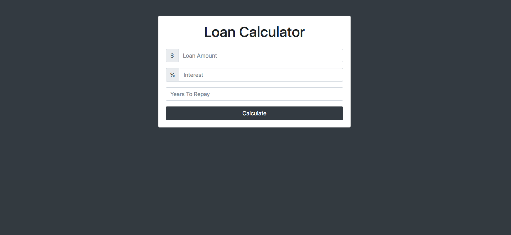
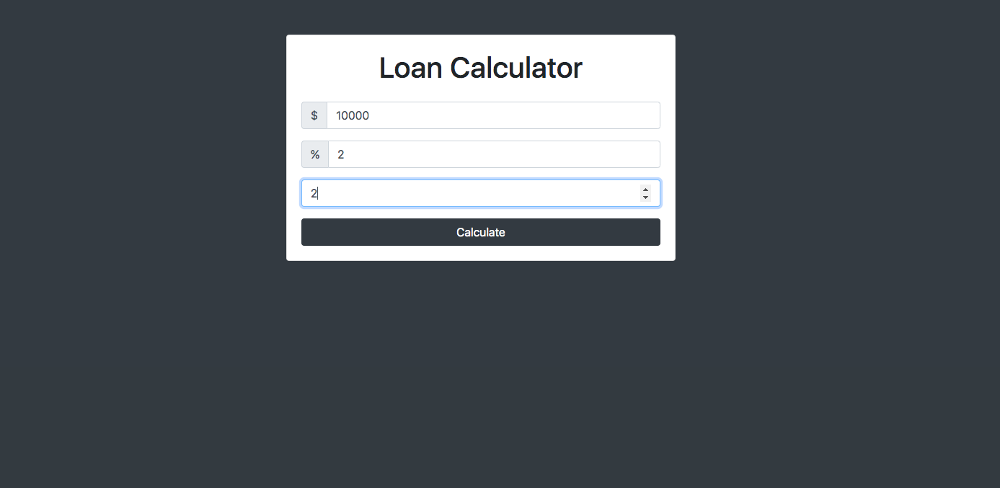
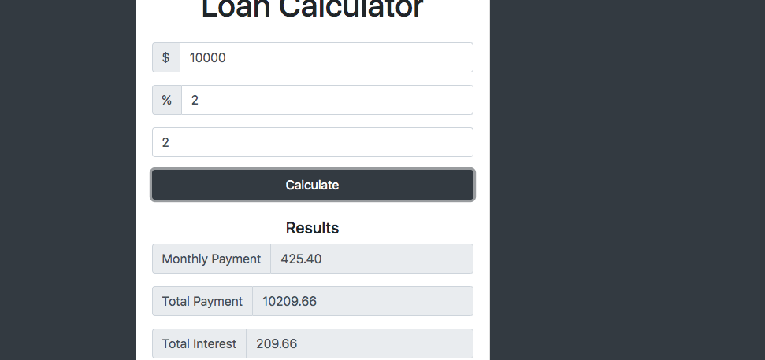

# Loan-Calculator

## Application  description:

The loan Calculator allows users to  put in the loan they owe, the interests of the loan, and how many years they have to repay the loan.

 ## Click [here](https://brianlevin.github.io/Loan-Calculator/ for the live app. 
 
 This is the home screen:
 
 
  
  The users can put in the values they want to calculate:
  
  
  
  The results will then be displayed:
    
   
## Libraries and Frameworks:

- HTML
- CSS
- Javascript

## Email:

bml201095@gmail.com

